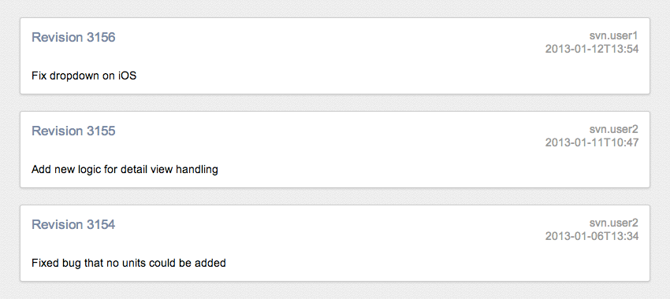
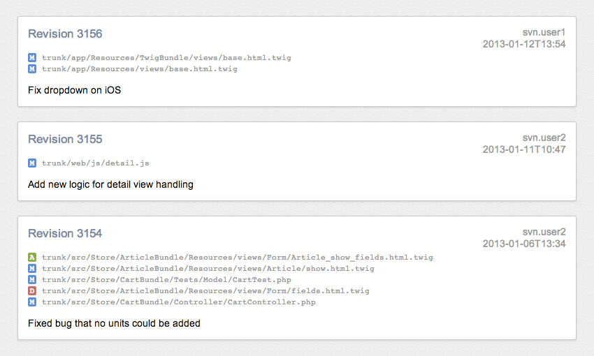

# svnlog
### A more readable SVN log for the browser

`svnlog` is an alternative to the regular `svn log` command to deliver more readable results in the browser, while accepting all its parameters.

By default, svnlog limits the output to the last 20 commits. You can change this using the `--limit` parameter:

    $ svnlog --limit 10

This will output the last 10 commits instead.

To show all files affected by the commit, use the `--verbose` switch:

    $ svnlog --verbose

## License
Copyright (c) 2013 Frederic Hemberger.  
Licensed under the [MIT license](LICENSE-MIT).